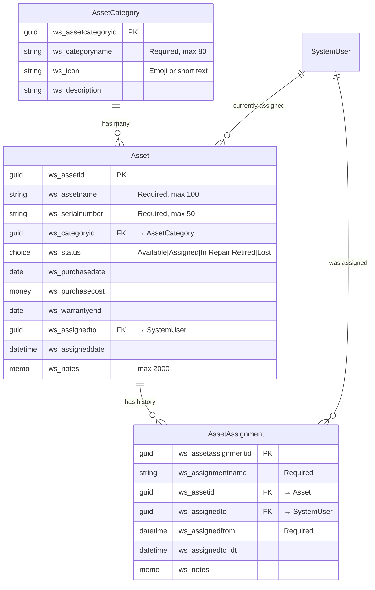

# Asset Management — Data Model

## Entity Relationship Diagram



## Tables

### Asset Category (`ws_assetcategory`)
Reference data — Laptop, Phone, Monitor, Headset, etc. Owned by Organization (admins maintain).

### Asset (`ws_asset`)
The core entity. One row per physical/logical IT asset. Status drives most workflows.

### Asset Assignment (`ws_assetassignment`)
Append-only audit log. Every time an asset is assigned or unassigned, a row is created. Enables historical reporting ("what laptops did this user have over the past 3 years?").

## Status Lifecycle

```
Available ─────▶ Assigned ─────▶ Available
    │              │
    │              ▼
    │           In Repair ──▶ Assigned / Available
    │
    ├─▶ Retired
    └─▶ Lost
```

## Key Constraints

- `ws_serialnumber` is unique within active assets (alternate key)
- Deleting `ws_assetcategory` is **Restricted** if any asset references it
- Deleting `ws_asset` performs **RemoveLink** on assignments (preserves audit history)

## Security Roles

| Role | Read | Write | Delete | Scope |
|---|---|---|---|---|
| Asset Reader | All | None | None | Org |
| Asset Manager | All | All | None | Business Unit |
| Asset Administrator | All | All | All | Org |

## Reporting Views (Dataverse)

| View | Filter | Sort |
|---|---|---|
| Available Assets | `ws_status = Available` | `ws_assetname asc` |
| My Assigned Assets | `ws_assignedto = current user` | `ws_assigneddate desc` |
| Out of Warranty | `ws_warrantyend < today` | `ws_warrantyend asc` |
| Recently Assigned | `ws_assigneddate > today - 30` | `ws_assigneddate desc` |

## Schema Source

Authoritative schema definition: [`../dataverse/schema.yaml`](../dataverse/schema.yaml)

To create the tables in a Dataverse environment:

```powershell
.\automation\CreateSchema.ps1 `
    -Schema examples\asset-management\dataverse\schema.yaml `
    -Environment dev
```
